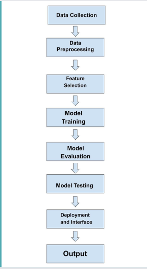
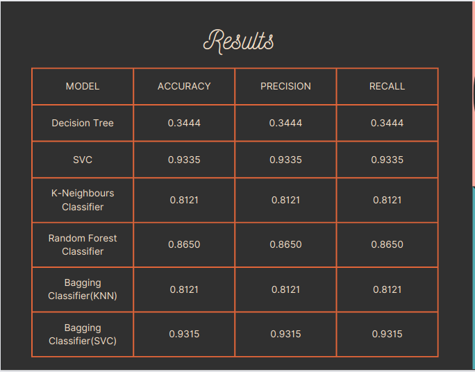
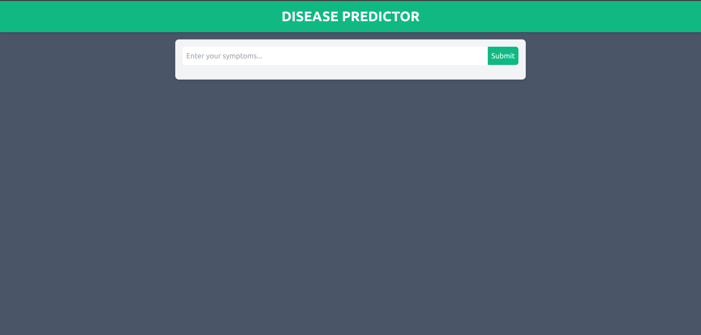
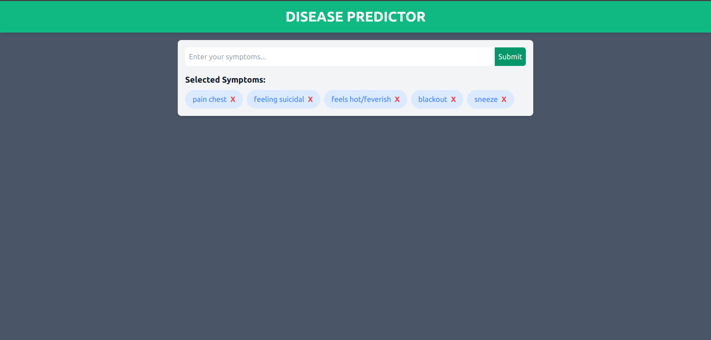
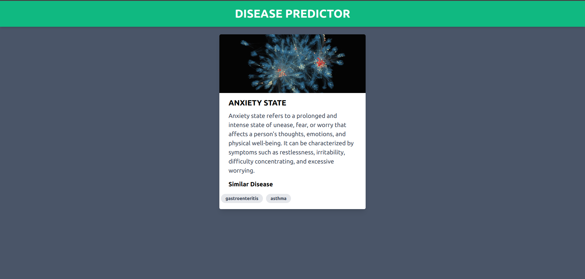

# MODERN DISEASE PREDICTOR WITH CHATGPT

## 🌐 Overview

The Machine Learning Disease Prediction Web App is an innovative health platform built using **React** and **Vite** on the frontend, and **Flask** for the backend. Its main goal is to offer users an intelligent, easy-to-navigate interface that predicts likely diseases based on provided symptoms.

---

## 🚀 Key Features

### 🧱 Technology Stack
- **Frontend:** React + Vite for a fast and responsive UI.
- **Backend:** Flask, a lightweight Python web framework.

### 🧠 Machine Learning Integration
- Core prediction is driven by trained machine learning models capable of identifying diseases based on symptom patterns.

### 🤖 ChatGPT Integration
- Integrated ChatGPT for a conversational layer, helping users understand the predicted disease and learn more about it interactively.

---

## ⚙️ How It Works

1. **User Input:**  
   Users input their symptoms through an intuitive interface.

2. **ML-Based Prediction:**  
   The symptoms are analyzed using trained ML models to predict potential diseases.

3. **ChatGPT Response:**  
   Users can chat with ChatGPT to get more insights about the diagnosis and relevant information.

---

## 💡 Benefits

- **Easy-to-Use Interface:** Accessible to users of all technical backgrounds.
- **Educational Chat Feature:** Helps users learn more about their health conditions.
- **Mobile-Friendly Design:** Fully responsive across all devices.

---

## 🧪 Methodology

### 📊 Data Collection
- Curated a diverse dataset mapping symptoms to diseases.
- Ensured high-quality labels and accurate data annotations.

### 🧼 Preprocessing
- Cleaned data by handling missing values, outliers, and duplicates.

### 📉 Feature Engineering
- Applied techniques like Feature Selection and PCA to manage high-dimensional data.

### 🧠 Model Building
- Explored models such as Random Forest, SVM, Gradient Boosting, and ensemble methods.

### 🔍 Evaluation
- Split data into training/test sets.
- Used cross-validation and performance metrics to choose the best model.

### 🛠️ Hyperparameter Tuning
- Implemented Grid Search CV and Random Search CV for optimization.

### 🚀 Deployment
- Deployed the optimized model with a clean and scalable web interface.

---

## 🏗️ Architecture Diagram

---

## 📈 Results

> While the SVC model had the highest accuracy, Bagging (SVC) was selected for deployment due to its ensemble-based robustness and lower variance, making it more reliable in real-world use.

---

## ✅ Conclusion

The **Modern Disease Predictor** is more than a diagnostic app—it's a comprehensive health companion. It not only predicts diseases but also educates users via an engaging, chat-based interaction to promote better understanding and health management.

---

## 🖼️ App Preview

### 🏠 Homepage  

### 🔍 Search Interface  

### 📊 Result Page  

